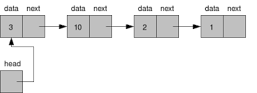
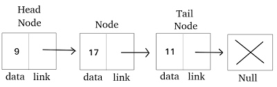

# 리스트
## 연결리스트
### 리스트
리스트는 순서가 있는 데이터를 늘어놓은 자료구조입니다.. 리스트는 선형리스트와 연결리스트가 있습니다. 리스트는 비상연락망과 같은 구조입니다. 따라서 누군가를 건너 뛰거나 뒤돌아 앞 사람에게 연락을 해서는 안됩니다.

### 용어
- 노드: 연결리스트에서 각각의 원소로 데이터와 포인터를 갖습니다.
- 머리노드: 연결리스트에서 맨 앞에 있는 노드
- 꼬리노드: 연결리스트에서 맨 뒤에 있는 노드
- 앞쪽노드: 각 노드에서 바로 앞에 있는 노드
- 뒤쪽노드: 각 노드에서 바로 뒤에 있는 노드

### 배열 대신 연결리스트로 리스트를 구현해야 하는 이유
데이터를 추가 · 삭제를 빈번하게 해야할 때 배열은 O(N)이 걸리는 반면에 연결리스트는 O(1)입니다.

## 포인터를 이용한 연결리스트
### 노드

연결리스트의 기본 단위는 노드입니다. 노드는 data 와 next라는 필드를 갖습니다. data에는 값 자체가 아니라 값에 대한 참조가 저장됩니다. next는 다음 노드의 참조가 저장됩니다.

```python
class Node:
    """연결리스트용 노드 클래스"""

    def __init__(self, data: Any = None, next: None = None):
        """초기화"""
        self.data = data  # 데이터
        self.next = next  # 뒤쪽 포인터
```
자기 자신과 동일한 형을 참조하는 필드를 갖는 구조를 자기참조형이라고 합니다.

### 연결리스트

연결리스트는 노드를 기본단위로 삼습니다. 연결리스트는 머리 노드, 현재 주목하는 노드 그리고 노드의 개수를 필드로 갖습니다. 머리노드는 head, 주목노드는 current, 노드의 개수는 no 로 표현합니다.

### 연결리스트의 상태

> 연결리스트가 비어 있는 경우
> 

연결리스트가 비어 있는 경우 head 값은 None 입니다.

```python
head is None
```

> 연결리스트가 노드를 1개 갖는 경우
> 

연결리스트가 노드를 한개 갖는 경우, head.next의 값은 None 입니다.

```python
head.next is None
```

> 연결리스트가 노드를 2개 갖는 경우
> 

head.next.next의 값은 None 입니다.

```python
head.next.next is None
```

> 꼬리 노드를 판단하는 법
> 

리스트의 노드를 참조하는 변수 p가 있는 경우, p.next가 None 일때, p는 꼬리노드입니다.

```python
p.next is None
```

### 연결리스트의 연산
### 연결리스트의 연산

`**search()`함수**

```python
    def search(self, data: Any) -> int:
        """data의 값이 같은 노드를 검색"""

        cnt = 0
        ptr = self.head
        while ptr is not None:
            if ptr.data == data:
                self.current = ptr
                return cnt
            cnt += 1
            ptr = ptr.next
        return -1

```

**`__contains__()`** 함수

```python
    def __contains__(self, data: Any) -> bool:
        """연결리스트에 data 가 있는 지 확인"""
        return self.search(data) >= 0
```

**`add_first()` 함수**

```python
    def add_first(self, data: Any) -> None:
        """연결리스트의 헤드에 데이터 삽입"""
        ptr = self.head
        self.head = self.current = Node(data, ptr)
        self.no += 1

```

`**add_last()` 함수**

```python
    def add_last(self, data: Any) -> None:
        """연결리스트의 꼬리에 데이터 삽입"""
        if self.head is None:
            self.add_first(data)
        else:
            ptr = self.head
            while ptr.next is not None:
                ptr = ptr.next
            ptr.next = self.current = Node(data, None)
            self.no += 1

```

`**remove_last()` 함수**

```python
    def remove_last(self) -> None:
        """꼬리 노드 삭제"""
        if self.head is not None:
            if self.head.next is None:
                self.remove_first()
            else:
                ptr = self.head
                while ptr.next.next is not None:
                    ptr = ptr.next
                self.current = ptr
                no -= 1

```

**`remove_first()` 함수**

```python
    def remove_first(self) -> None:
        """머리노드 삭제"""
        if self.head is not None:
            self.head = self.current = self.head.next
        self.no -= 1

```

`**remove()` 함수**

```python
    def remove(self, p: Node) -> None:
        """노드 p를 삭제"""
        if self.head is not None:
            if p is self.head:
                self.remove_first()
            else:
                ptr = self.head

                while ptr.next is not p:
                    ptr = ptr.next
                    if ptr is None:
                        return
                ptr.next = p.next
                self.current = ptr
                self.no -= 1

```